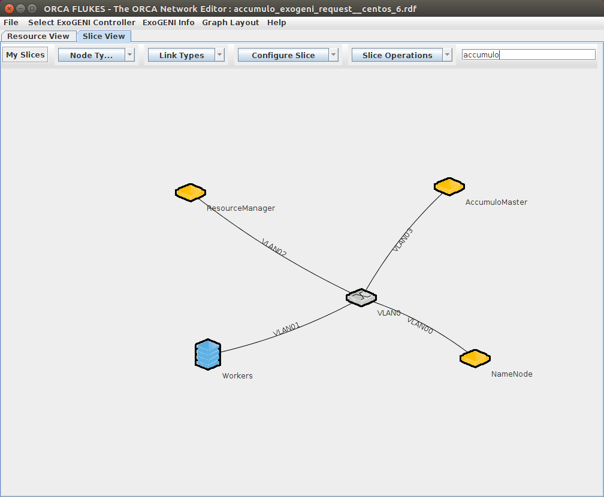

This recipe installs and configured Zookeeper and Accumulo on top of the [hadoop 2.7.3](../hadoop/hadoop-2.7.3/) recipe.  Please see that README for details on the Hadoop installation. Starting with a base OS image represents a trade-off between customizability and fast startup times -- after ExoGENI reports the nodes are available, installation and configuration of Accumulo will take approximately 5 minutes.

Zookeeper is installed into `/opt`, and are owned (and run) by the `root` user.

Accumulo is installed into `/opt`, and are owned (and run) by the `hadoop` user.

Accumulo has _not_ been configured for Security.

## Web Interfaces
_WARNING_ these web interfaces are currently open with unrestricted/unauthenticated world-wide public internet access. Also please note the warning on web interfaces from the [hadoop 2.7.3](../hadoop/hadoop-2.7.3/) recipe.
* Accumulo Monitor: http://AccumuloMaster:9995/

## Zookeeper
The nodes `NameNode`, `ResourceManager`, and `AccumuloMaster` act as the Zookeeper cluster of `zoo1`, `zoo2`, and `zoo3` (respectively).

## Accumulo
The node `AccumuloMaster` runs the master, monitor, gc, and tracer services.  The `Worker` nodes act as tablet servers.

## References
* https://zookeeper.apache.org/doc/r3.3.3/index.html
* https://accumulo.apache.org/1.8/accumulo_user_manual.html
