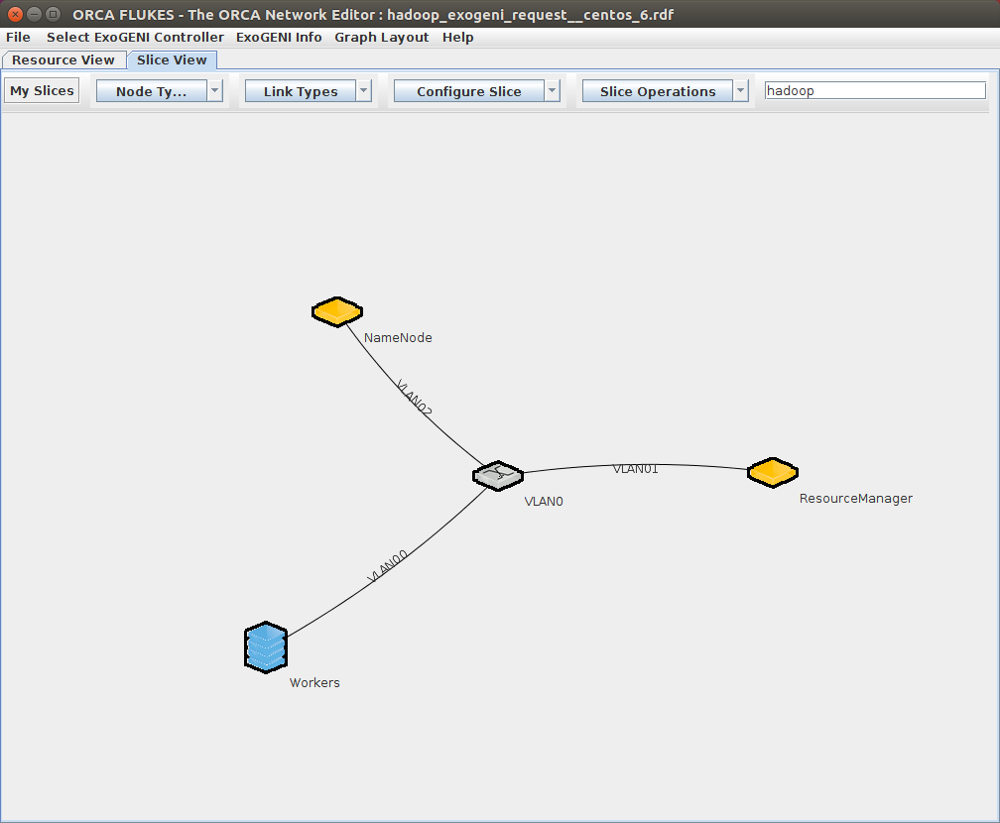

This recipe is similar to the [hadoop tutorial](../hadoop-tutorial/) recipe, but starts with a base Centos image, and installs and runs Hadoop on top of that.  Starting with a base OS image represents a trade-off between customizability and fast startup times -- after ExoGENI reports the nodes are available, installation and configuration of Hadoop will take approximately 5 minutes.

Hadoop is installed into `/opt`, and are owned (and run) by a `hadoop` user.

Hadoop is configured in _Non-Secure Mode_.  You may need to reconfigure for additional security.

## Web Interfaces
_WARNING_ these web interfaces are currently open with unrestricted/unauthenticated world-wide public internet access.  In this configuration, any files stored in HDFS can be downloaded via the web interface.
* NameNode: http://NameNode:50070/
* ResourceManager: http://ResourceManager:8088/
* JobHistory: _currently not enabled_

## Known Issues
* CentOS 7: `firewalld` is currently preventing the Hadoop cluster from communicating, presumably because `eth0` is not being correctly placed in the `trusted` zone.

## References
* http://hadoop.apache.org/docs/r2.7.3/hadoop-project-dist/hadoop-common/ClusterSetup.html
